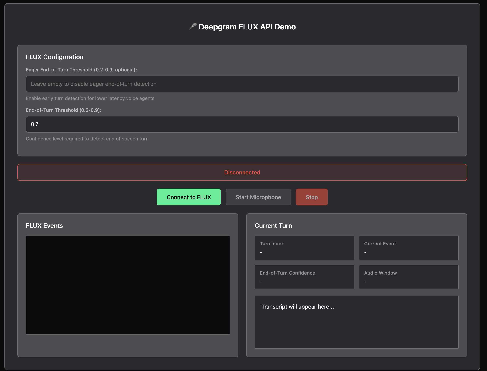

# Deepgram FLUX Streaming Demo

A simple JavaScript demo application for testing the Deepgram FLUX API - the first conversational speech recognition model designed for voice agents.

## 🎯 What is FLUX?

> TODO: Make sure this link works after docs deploy

FLUX is Deepgram's breakthrough conversational AI model that understands **turn-taking dynamics** - not just transcribing words, but knowing when to listen, when to think, and when to speak. Perfect for building voice agents and interactive applications. Learn more about Flux by checking out our [Documentation](https://developers.deepgram.com/docs/stt/getting-started)

## Demo Browser Support

This demo will run in Chrome and Safari browsers only. No Firefox support.

## ✨ Demo Features

- **🎤 Real-time microphone input** with Linear16 PCM audio processing
- **🔄 Turn-based speech recognition** optimized for conversations
- **⚡ Ultra-low latency** with model-integrated end-of-turn detection
- **🎯 Smart turn detection** with configurable confidence thresholds
- **🚀 WebSocket proxy server** with proper authentication
- **📊 Live event monitoring** with detailed FLUX response logging
- **🎨 Modern responsive UI** with real-time transcript display

### FLUX Turn-Based Events:
- **`StartOfTurn`** - User begins speaking (trigger interruption)
- **`Update`** - Real-time transcript updates during speech
- **`Eager EndOfTurn`** - Medium confidence turn end (start preparing response)
- **`TurnResumed`** - Speech continues after Eager EndOfTurn (cancel response)
- **`EndOfTurn`** - High confidence turn end (send to LLM)

## 🚀 Quick Start

### Prerequisites
- Node.js 14.0.0 or higher
- Deepgram API key with FLUX early access
- Modern browser with microphone access

### Setup

1. **Clone and install:**
   ```bash
   git clone git@github.com:deepgram-devs/deepgram-flux-demo.git
   cd deepgram-flux-demo
   npm install
   ```

2. **Set your Deepgram API key:**
   ```bash
   export DEEPGRAM_API_KEY="your_deepgram_api_key_here"
   ```

3. **Start the server:**
   ```bash
   npm start
   ```

4. **Open the demo:**
   Navigate to `http://localhost:3000`

 Note: To open the demo in Production Mode run `NODE_ENV=production npm start` and navigate to: `http://localhost:3000/flux-streaming`

### Testing FLUX

1. **Connect**: Click "Connect to FLUX"
2. **Start microphone**: Click "🎤 Start Microphone" and grant browser permissions
3. **Speak clearly**: The app will show real-time transcription and turn events
4. **Watch the magic**: Observe FLUX's turn detection and conversational flow

## ⚙️ Configuration Options

### Eager End-of-Turn Threshold (0.3-0.9, optional)
- **Leave empty**: Disable for simpler implementation
- **Lower values (0.2-0.4)**: More aggressive early turn detection
- **Higher values (0.6-0.9)**: More conservative early turn detection
- **Recommended**: Start with 0.6 for balanced performance

### End-of-Turn Threshold (0.5-0.9)
- **Default**: 0.7 (good balance of speed and accuracy)
- **Lower values**: Faster turn detection, more false positives
- **Higher values**: More confident detection, slightly higher latency

## 🏗️ Architecture

This demo uses a **production-ready WebSocket proxy pattern**:

```
Browser ←→ Local Proxy Server ←→ Deepgram FLUX API
```

**Why a proxy?**
- **🔐 Security**: API key stays server-side, never exposed to browser
- **🌐 Compatibility**: Works with all browsers (WebSocket auth limitations)
- **🚀 Production-ready**: Same pattern used in real voice agent applications
- **🔄 Message handling**: Proper binary/text conversion for FLUX responses

**Ports:**
- **3000**: Web interface and WebSocket proxy (both on same port)

## 🎵 Audio Requirements

FLUX API has **strict audio format requirements**:

- **Format**: Linear16 PCM (raw 16-bit signed little-endian)
- **Sample Rate**: 16000 Hz (16kHz)
- **Channels**: Mono only
- **Chunk Size**: 1024 samples (64ms) for optimal performance
- **Input**: Browser microphone with real-time processing

**Note**: Compressed formats (MP3, AAC, WebM) won't work with FLUX API.

## 🚀 Deployment

This demo is containerized and ready for deployment to any platform that supports Docker.

### Deployment Files Included
- **`Dockerfile`**: Multi-stage Node.js container setup
- **`fly.toml`**: Fly.io configuration (can be adapted for other platforms)

### Environment Variables
- **`DEEPGRAM_API_KEY`**: Your Deepgram API key (required)

### Base Path Support
The application supports flexible routing:
- **Local development**: Both `http://localhost:3000` and `http://localhost:3000/flux-streaming` work
- **Production**: Can be deployed at any base path (configured via `/flux-streaming` by default)
- **WebSocket connections**: Automatically adapt to the host and path structure

## 🔧 Troubleshooting

### Connection Issues
- **Check API key**: Verify `DEEPGRAM_API_KEY` environment variable is set
- **FLUX access**: Ensure your Deepgram account has FLUX early access enabled
- **Port conflicts**: Make sure port 3000 is available
- **Server logs**: Check terminal for detailed connection error messages

### Microphone Issues
- **Browser permissions**: Ensure microphone access is granted
- **Audio levels**: Look for "🎵 Audio level" messages in the browser log
- **No transcripts**: Check if you see "📤 Sending chunk" messages
- **HTTPS**: Some browsers require HTTPS for microphone access

### No FLUX Responses
- **Check server logs**: Should see "📨 Deepgram response" messages
- **WebSocket connection**: Verify proxy server shows "✅ Connected to Deepgram FLUX API"
- **Audio format**: FLUX requires Linear16 PCM (handled automatically by the app)
- **Early access**: Confirm your account has FLUX API access

## 📊 What You'll See Working

When everything is working correctly, you should see:

**🖥️ Browser Interface:**
- Real-time transcript updates as you speak
- Turn Index, Current Event, and Confidence scores updating
- FLUX Events log showing JSON responses from the API
- Audio level indicators showing microphone input

**💻 Server Logs:**
- Connection success to Deepgram FLUX API
- Audio chunks being forwarded (2048 bytes each)
- FLUX responses with TurnInfo events
- Message type debugging information


